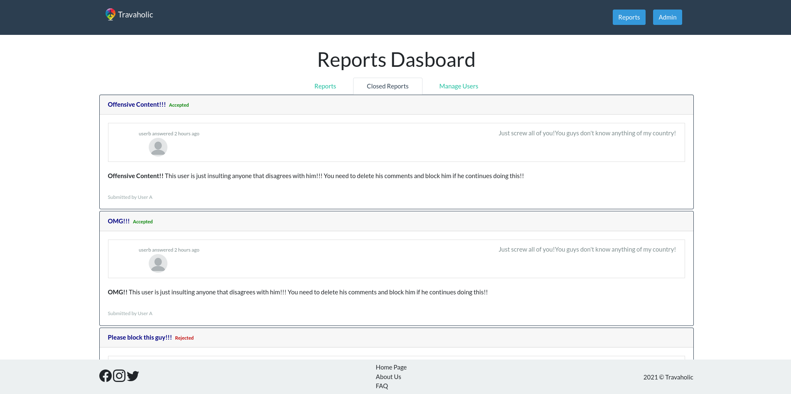
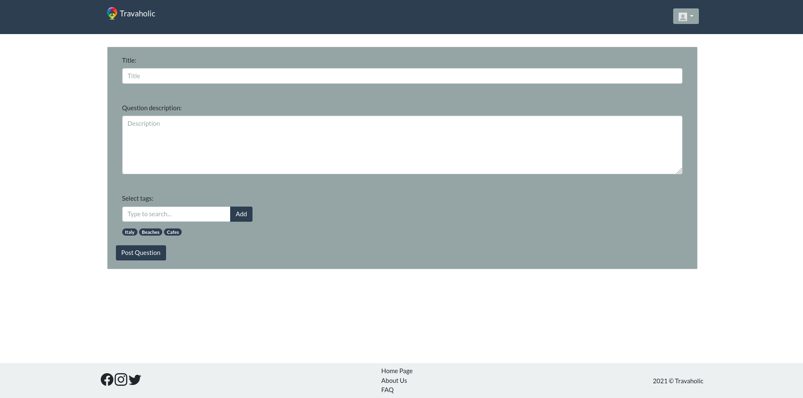
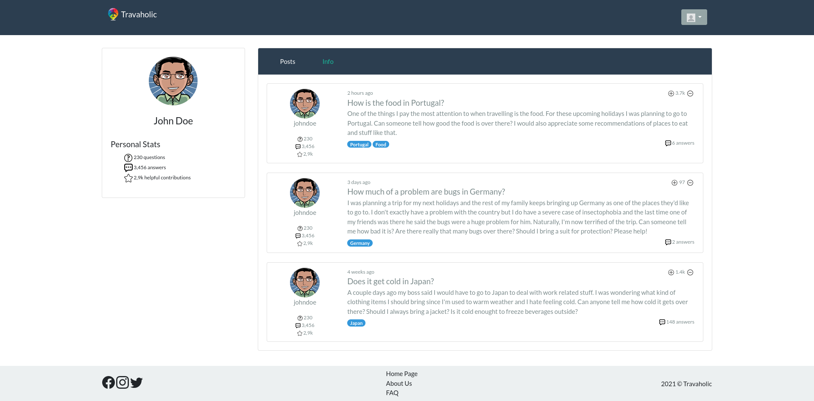
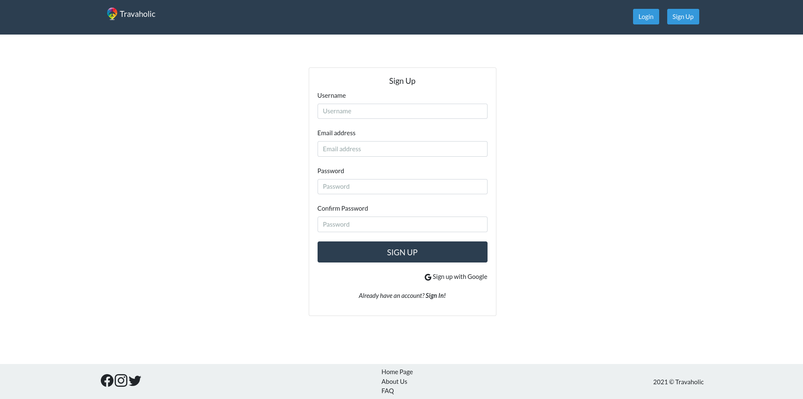

# Collaborative Q&A
 Travelers all around the globe flood the internet with searches regarding recommendations for their trips. Travaholic shows up as a powerful solution and tool for all of them providing a social platform that allows them to question and answer other users.

# ER: Requirements Specification
## A1: Travaholic

With this project, we aim to create a platform where people who are interested in traveling or intend to travel somewhere can ask questions and/or provide answers with the intent of helping others who want to travel. 

We believe that, due to the exponential growth of traveling and how accessible it has become, it is imperative to have an application that provides a trusted resource for travelers
with valued advice and insights from the community. Every affirmation or opinion stated is subjected to the approval (or not) of contributors, guaranteeing that no misinformation is spread. We’re providing an archive complete with every possible question one might come across when planning a trip - from trivial logistical issues to personal preferences and suggestions. 

The website's main functionalities are asking and answering questions related to travel. Both can also be commented on when doubt about its content arises. Questions, answers, and comments can be upvoted or downvoted by other users to promote relevant contributions while hiding irrelevant ones. Any malicious content can be reported and later deleted. Questions fall into different categories; going from location as in city or country to a specific topic such as destination types or form of transport. Every question, answer, and comment can be edited by its creator. Homepages are personalized, by prioritizing questions that share tags with the user’s interests and location. When conducting searches, if no exact result (question, answer, or comment) is found, similar ones are presented. Furthermore, previously mentioned elements like tags, locations, and ratings can be used to filter the results shown, along with dates. 

Users are separated into three distinct groups with different permissions. The visitor group includes people who aren’t logged in and can only see previously posted questions, comments, and answers. The authenticated group includes those who, after logging into their account, can not only ask and answer questions but also leave comments, upvote or downvote an entry and report any malicious content. They also have access to their personal space, where they can determine their preferences and interests, ensuring a more customized homepage. The administrator includes those who can move questions from one section to another, remove offensive comments, replies, or users, they can also change critical parts of the platform like creating new sections or changing the look of the website. In order to streamline their work, through a dashboard, the administrators also have access to all the reports that have been made and can review them, deciding to take further actions such as removing the comments/replies, banning a user, or even completely deleting a question and all its contents.

## A2: Actors and User stories

In this artifact, we showcase the actors and user stories related to our project which form its requirements.

### Actors

Figure 1: Actors.
|Identifier|Description|Examples|
|-|-|-|
|User|Generic user that can access all the public content such as the questions, their answers, and their comments.|n/a|
|Visitor|Unauthenticated user that has access to all posts and that can register itself or log into the system.|n/a|
|Authenticated|Authenticated user that can post questions, answers, and comments.|jlopes|
|Owner|Authenticated user that is the author of a message being it a question, answer, or comment, and can edit or remove it.|jlopes|
|Administrator|Authenticated user that is responsible for the management of users and for some specific supervisory and moderation functions.|jlopes|
|OAuth API|External OAuth API that can be used to register or authenticate into the system.|Google|

Table 1: Actor's description

### User Stories
#### User
|Identifier|Name|Priority|Description|
|-|-|-|-|
|US01|Discover|high|As a *User*, I want to be able to access a generic homepage, a FAQ page, an about us page, and a question exploration page, so that I can read all posted questions, answers, and comments, and general information about the website.|
|US02|Search|high|As a *User*, I want to be able to conduct a filtered search, so that I can have access to every post that fits my criteria.|
|US03|View profiles|low|As a *User*, I want to view the profile of other users so that I can see more information about them.|

Table 2: User's user stories

#### Visitor
|Identifier|Name|Priority|Description|
|-|-|-|-|
|US11|Sign-in|high|As a *Visitor*, I want to authenticate into the system, so that I can access privileged information.|
|US12|Sign-up|high|As a *Visitor*, I want to register myself into the system, so that I can authenticate myself into the system.|
|US13|Sign-in with API|low|As a *Visitor*, I want to authenticate into the system using my Google account, so that I can access privileged information.|
|US14|Sign-up with API|low|As a *Visitor*, I want to register myself into the system using my Google account, so that I can authenticate myself into the system.|

Table 3: Visitor's user stories

#### Authenticated
|Identifier|Name|Priority|Description|
|-|-|-|-|
|US21|Ask Question|high|As an *Authenticated* user, I want to ask a question, so that any other users may answer it.|
|US22|Reply to Question|high|As an *Authenticated* user, I want to answer posted questions, so that I can give my opinion on the matter.|
|US23|Write comment|high|As an *Authenticated* user, I want to post a comment on a posted question or answer, so that I can give my opinion on the matter.|
|US24|Vote|high|As an *Authenticated* user, I want to upvote or downvote a question, answer or comment, so that I can rate them.|
|US25|Edit profile|high|As an *Authenticated* user, I want to change my information, so that I can keep it updated (e.g. changing the password).
|US26|Logout|high|As an *Authenticated* user, I want to logout of the platform so that I am not constantly logged in.
|US27|Report content|medium|As an *Authenticated* user, I want to report questions, answers, and comments so that inappropriate content may be removed.
|US28|Personalized homepage|medium|As an *Authenticated* user, I want to edit my favorite topics so that I  have access to a personalized homepage, with content relevant to me.|
|US29|Follow other users|low|As an *Authenticated* user, I want to follow other authenticated users so that my homepage has their content on it.|

Table 4: Authenticated user's user stories

#### Owner
|Identifier|Name|Priority|Description|
|-|-|-|-|
|US31|Edit content|medium|As an *Owner*, I want to edit a previous question, answer and comment of mine, so that I can correct any mistakes it contains.|
|US32|Delete own content|medium|As an *Owner*, I want to remove a previous question, answer and comment of mine, so that I can get rid of content I'm not proud of.

Table 5: Owner's user stories

#### Administrator
|Identifier|Name|Priority|Description|
|-|-|-|-|
|US41|Remove content|high|As an *Administrator*, I want to remove a question, answer or comment, so that I can remove inappropriate content.|
|US42|Edit Question Category|high|As an *Administrator*, I want to edit a question’s associated category, so that I can correct any inconsistency on the user’s part.|
|US43|Create/Remove Categories|high|As an *Administrator*, I want to add new categories or delete existing ones so that the website can remain relevant.|
|US44|Moderate content|high|As an *Administrator*, I want access to a list of unassigned reports so that I can manage which reports I want to take care of.
|US45|Ban user|medium|As an *Administrator*, I want to ban a system user, so that he can no longer post on the site until further notice.|

Table 6: Administrator's user stories

### Supplementary Requirements

#### Business Rules

|Identifier|Name|Description|
|-|-|-|
|BR01|Self Promote|A user cannot vote on his own questions, answers, and comments.|
|BR02|Ownership|A user can only edit/delete the content of his own.|
|BR03|Feedback Loop|A user can comment and answer questions and answers of his own and those of other users.|
|BR04|Submission Date|The date of responses and comments submitted must be greater than or equal to the date on which the question was submitted.|

Table 7: Business Rules Description

#### Technical Requirements
|Identifier|Name|Description|
|-|-|-|
|TR01|Scalability|The system must be able to handle the growth of users as well as the increase in information generated by them so that new content and users can always be added.|
|TR02|Usability|The system must be simple and easy to use by anyone (user friendly) so that even a new user can use the website effortlessly.|
|TR03|Security|The system must be as secure as possible, protecting all the information it contains so that the users' privacy can be assured.|

Table 8: Technical Requirements Description

#### Restrictions
|Identifier|Name|Description|
|-|-|-|
|C01|DeadLine|The system, on the delivery deadline, must be functional and with the main features totally implemented.|

Table 9: Restrictions Description

## A3: User Interface Prototype

This artifact's main goal was to prototype the product. It's a vital part of the process, given that it helps to identify and formulate the main trajectory of the design and saves time. It is intended not only to show the structure of the future website, but also the sitemap and the interaction between its pages. During the course of this artifact, the user requirements established previously were refined and modified when needed.

### 1. Interface and common features

**Travaholic** is a web application made with HTML, CSS, and JavaScript. Additionally, the Bootstrap framework was used to help with the creation of the UI.

Figure 2: Interface guidelines

1. **Navbar**
2. **Logo**
3. **Content**
4. **Footer**

The image shows elements that are present on every page, namely the navigation bar and the footer.

### 2. Sitemap

Figure 3: Sitemap

### 3. Wireflows

Figure 4: Wireflow centered on a Visitor's options.

Figure 5: Wireflow centered on an Authenticated User's options.

Figure 6: Wireflow centered on an Administrator's options.

[InVision project](https://projects.invisionapp.com/freehand/document/vqcpxL0rd?)

### 4. Interfaces

#### Page list
- Homepage
- About
- Reports
- Closed Reports
- Error
- FAQ
- User Management
- New Question
- Question
- Profile
- Sign-in
- Sign-up
- Profile (Admin)

#### UI01: Homepage

Figure 7: [Homepage](http://lbaw2124-piu.lbaw-prod.fe.up.pt)

#### UI02: About

Figure 8: [About us page](http://lbaw2124-piu.lbaw-prod.fe.up.pt/about-us.php)

#### UI03: Reports

Figure 9: [Reports page](http://lbaw2124-piu.lbaw-prod.fe.up.pt/reports.php)

#### UI04: Closed Reports

Figure 10: [Closed reports page](http://lbaw2124-piu.lbaw-prod.fe.up.pt/closed-reports.php)

#### UI05: Error

Figure 11: [Error page](http://lbaw2124-piu.lbaw-prod.fe.up.pt/error-page.php)

#### UI06: FAQ

Figure 12: [FAQ page](http://lbaw2124-piu.lbaw-prod.fe.up.pt/faq.php)

#### UI07: User Management

Figure 13: [User management page](http://lbaw2124-piu.lbaw-prod.fe.up.pt/manage-users.php)

#### UI08: New Question

Figure 14: [New question page](http://lbaw2124-piu.lbaw-prod.fe.up.pt/new-question.php)

#### UI09: Question

Figure 15: [Question page](http://lbaw2124-piu.lbaw-prod.fe.up.pt/post.php)

#### UI10: Profile

Figure 16: [Profile page](http://lbaw2124-piu.lbaw-prod.fe.up.pt/profile.php)

#### UI11: Sign-in

Figure 17: [Sign in page](http://lbaw2124-piu.lbaw-prod.fe.up.pt/sign-in.php)

#### UI12: Sign-up

Figure 18: [Sign up page](http://lbaw2124-piu.lbaw-prod.fe.up.pt/sign-up.php)
___
GROUP2124, 14/03/2021
- Alexandra Ferreira, [up201806784@fe.up.pt](mailto:up201806784@fe.up.pt)
- João Mascarenhas, [up201806389@fe.up.pt](mailto:up201806389@fe.up.pt)
- João Matos, [up201703884@fe.up.pt](mailto:up201703884@fe.up.pt) (editor)
- Marcelo Reis, [up201809566@fe.up.pt](mailto:up201809566@fe.up.pt)
